# VR Game

## Task 1. Movement by teleporting

### Task 1.1 Create teleports and add them to the scene
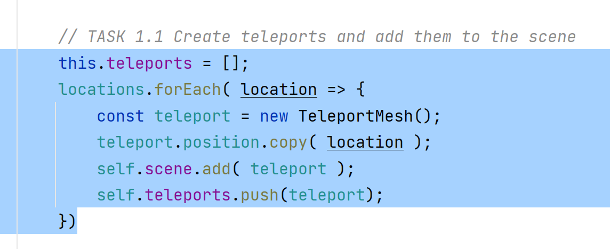

### Task 1.2 Display teleports when squeeze button is pressed

### Task 1.3 Hide teleports when squeeze button is released
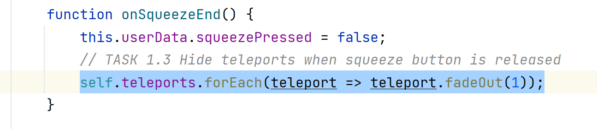

### Task 1.4 Redraw teleports with update method
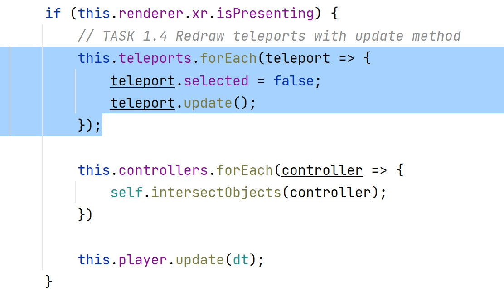

### Task 1.5 Define if controller pointing on teleport

#### Task 1.5.1 Add teleports cylinders to the collisionObjects 
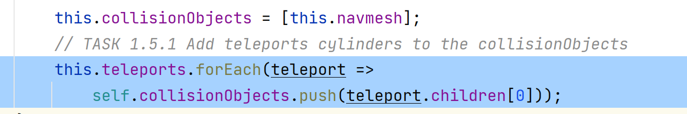

#### Task 1.5.2 Highlight and store intersected teleport
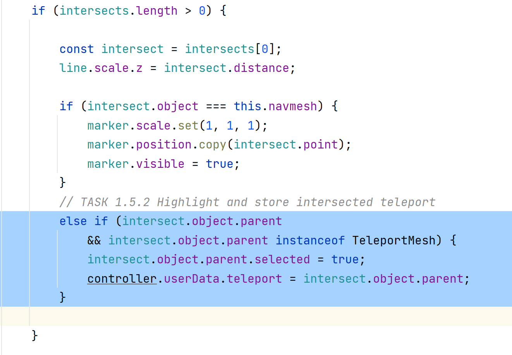

#### Task 1.6 On select press move to the selected teleport
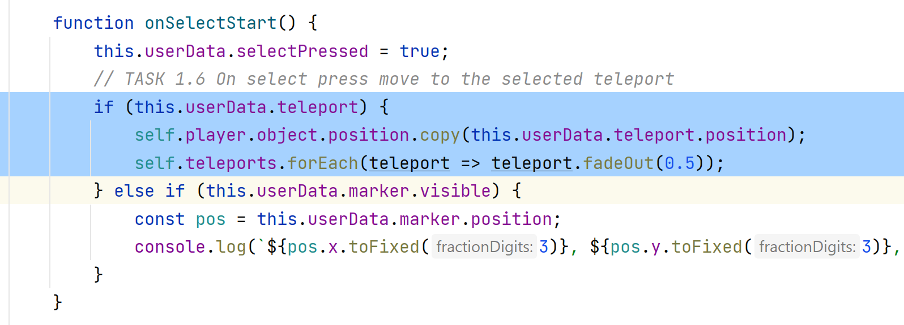

## Task 2. Interacting with meshes
- In the render loop, call update for each interactable mesh.
- Add meshes to the list of collisionObjects for selecting them by the controllers.
- Update the intersectObjects method to add the interactable to the controller's userData object.
- Update the onSelectStart function to handle the interactable.

### Task 2.1 Store and configure interactable meshes
#### Task 2.1.1 Create empty array for storing interacting meshes
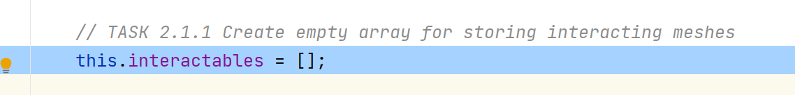

#### Task 2.1.2 Check if mesh is interacting
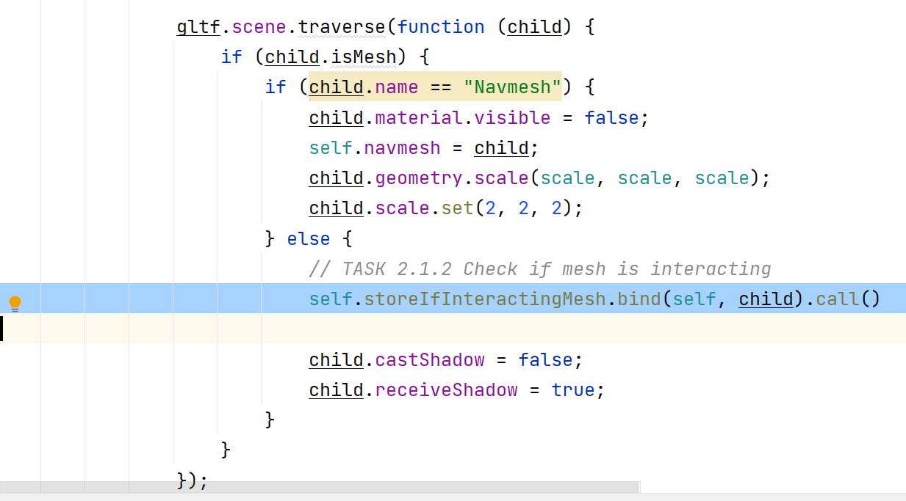

#### Task 2.1.3 Store if object is interacting meshes
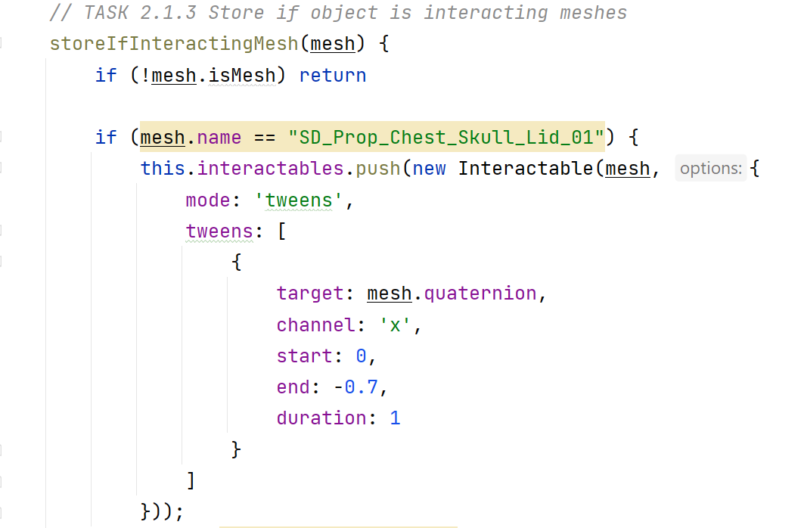
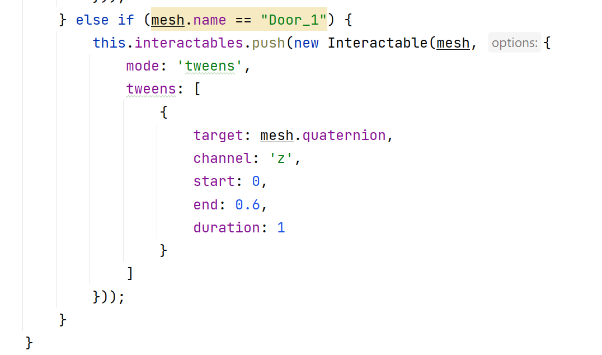

#### Task 2.2 Update interactable meshes
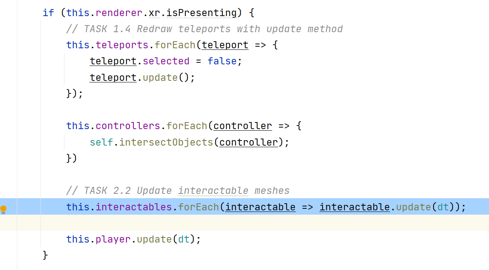

#### Task 2.3 Add meshes to the list of collisionObjects for selecting them by the controllers.
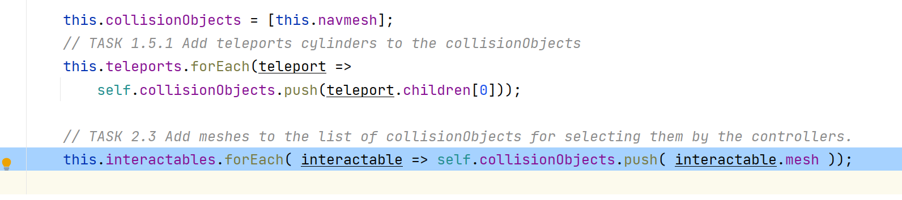

#### Task 2.4 Add the selected interactable to the controller's userData object.
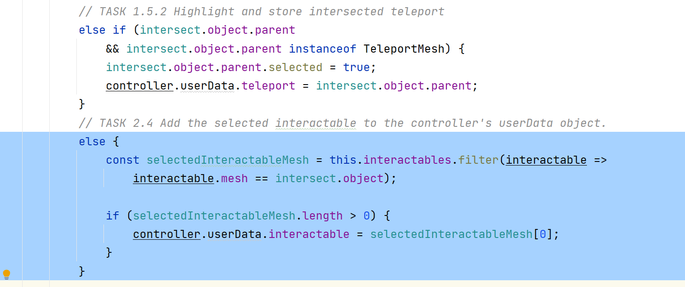

#### Task 2.5 Call play for the interactable
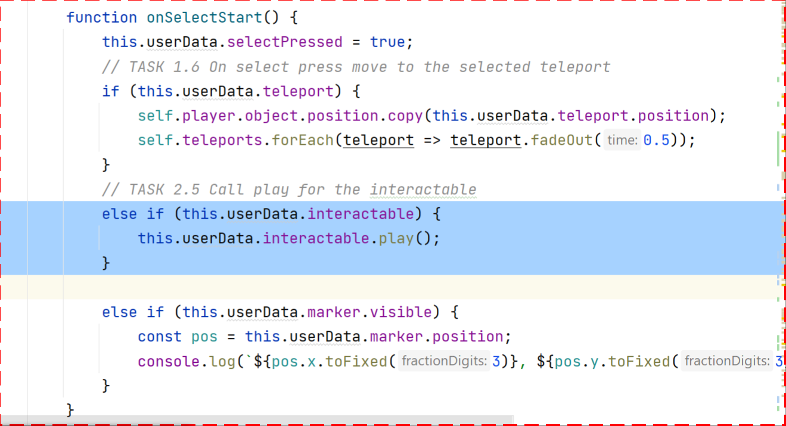

## Task 3. Using a controller as a weapon